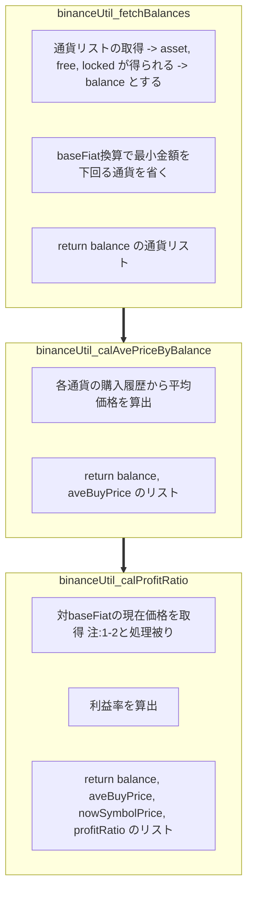
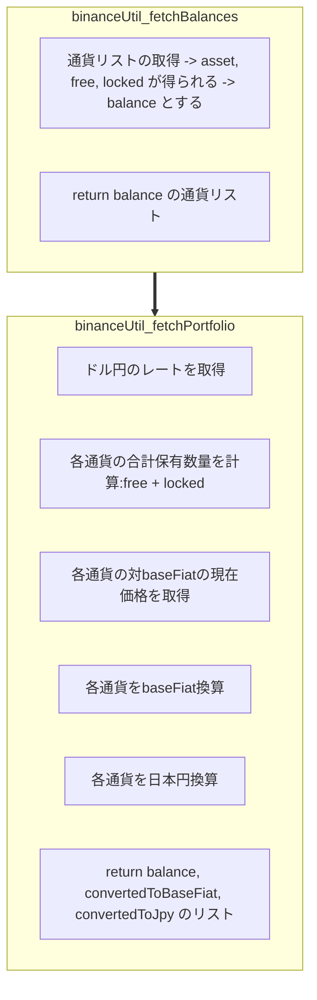
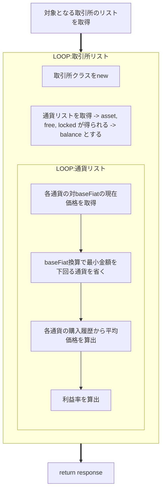
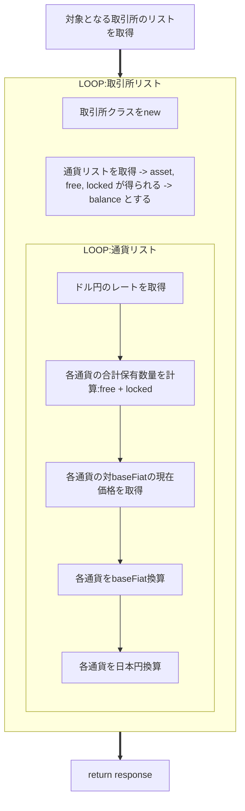
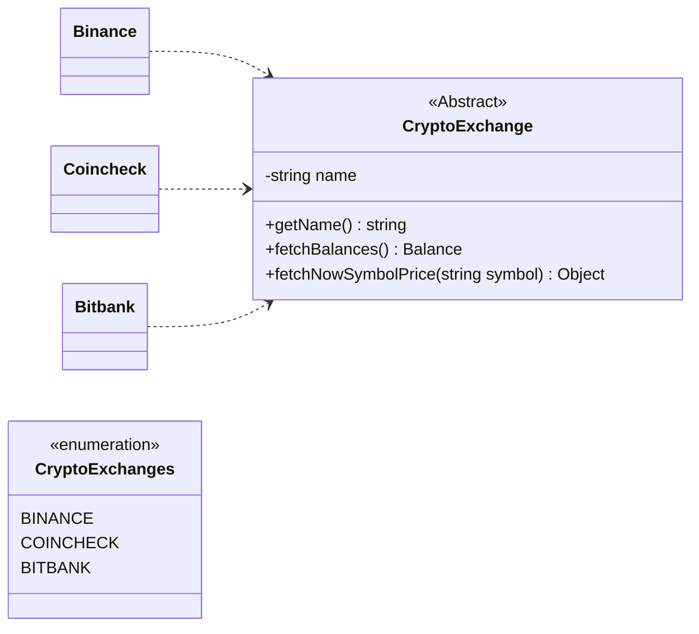

# 現状

- 仮想通貨取引所は Binance のみ

## フローチャート

### profit-ratio



### portfolio



---

# 改修後

- 仮想通貨取引所は Binance 以外も含む

  - Bitbank, coincheck, ...
  - どの仮想通貨取引所でもやることは同じなので抽象化を試みる

- BaseFiat はフロントからのパラメータとしたい

  - アプリ側から自由に選択できるようにするため

- 基本的には既存の処理はそのまま残し、新たなファイルを作り直す

  - 大幅変更のため、型定義などがごちゃまぜになることを防ぎたい

## response

### profit-ratio

```
[
  {
    crypto_exchange: string(ex. "Binance"),
    crypto: [
      'BTC': {
        balance: AssetBalance;
        aveBuyPrice: number;
        nowSymbolPrice: number;
        profitRatio: number;
      },
      'ETH': {
        balance: AssetBalance;
        aveBuyPrice: number;
        nowSymbolPrice: number;
        profitRatio: number;
      },
      ︙
    ]
  },
  {
    crypto_exchange: string(ex. "Bitbank"),
    crypto: [
      'BTC': {
        balance: AssetBalance;
        aveBuyPrice: number;
        nowSymbolPrice: number;
        profitRatio: number;
      },
      'ETH': {
        balance: AssetBalance;
        aveBuyPrice: number;
        nowSymbolPrice: number;
        profitRatio: number;
      },
      ︙
    ]
  },
  ︙
]
```

### portfolio

```
[
  {
    crypto_exchange: string(ex. "Binance"),
    crypto: [
      'BTC': {
        balance: AssetBalance;
        convertedToBaseFiat: number;
        convertedToJpy: number;
      },
      'ETH': {
        balance: AssetBalance;
        convertedToBaseFiat: number;
        convertedToJpy: number;
      },
      ︙
    ]
  },
  {
    crypto_exchange: string(ex. "Bitbank"),
    crypto: [
      'BTC': {
        balance: AssetBalance;
        convertedToBaseFiat: number;
        convertedToJpy: number;
      },
      'ETH': {
        balance: AssetBalance;
        convertedToBaseFiat: number;
        convertedToJpy: number;
      },
      ︙
    ]
  },
  ︙
]
```

## フローチャート

- 取引所のリスト
  - ログイン機能実装後はユーザ情報に紐づく取引所を DB から取得して作成する想定
  - 今はとりあえず固定で、API_KEY が設定されている取引所のリストを用いる

### profit-ratio



### portfolio



## クラス設計


